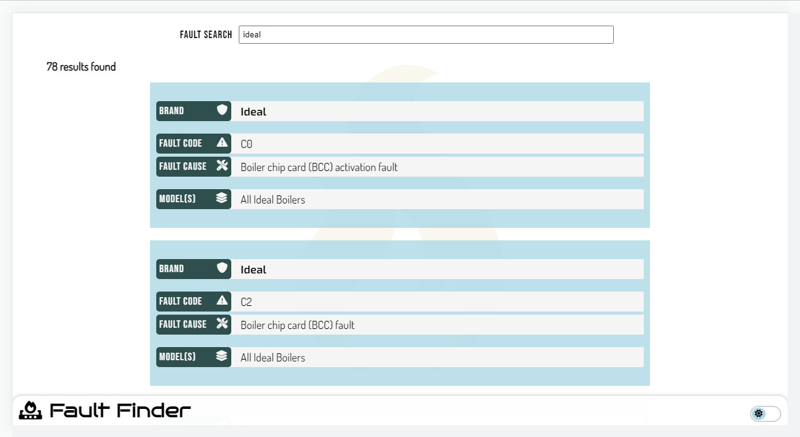

<a href="#"></a>
#  Fault-Finder

> ### Boiler fault code search application

<br>
<div align="center">
  <a href="#"></a>
  
  ##
  <a href="#"></a>
  <a href="#"></a>
  <a href="#"></a>
  <a href="#"></a>
  <a href="#"></a>

  <br>
</div>

<br>

## About
**Fault-finder** is a web application that takes fault information found in gas boiler manuals and wraps that data with search.

Built in <a href="https://github.com/facebook/react">**React**</a> with <a href="https://github.com/microsoft/TypeScript">**TypeScript**</a>, the application utilises **Functional Components** and **Hooks** to create reuseable reactive elements. **TypeScript** is leveraged mitigate easily avoidable errors, resulting in a smooth developer experience and better application overall. **CSS** is compiled using <a href="https://github.com/sass/sass">**Sass**</a> and used to create styling and layouts. Design is kept simple with straight-forward fonts, icons and colour palette.

<br>

## 📝 Features
<table>
  <thead>
  </thead>
  <tbody>
    <tr>
      <td><strong>🔹 Intuitive search</strong></td>
      <td>Search by fault code, product name or manufacturer</td>
    </tr>
    <tr><td colspan=2></td></tr>
  <tr>
      <td><strong>🔹 Detailed Results</strong></td>
      <td>Descriptive information regarding possible fault causes</td>
    </tr>
    <tr><td colspan=2></td></tr>
    <tr>
      <td><strong>🔹 Responsive design</strong></td>
      <td>Desktop and mobile layouts</td>
    </tr>
    <tr><td colspan=2></td></tr>
    <tr>
      <td><strong>🔹 Themes</strong></td>
      <td>Switchable light/dark mode colour themes</td>
    </tr>
    <tr><td colspan=2></td></tr>
  </tbody>
</table>

<br>
<p align="right">(<a href="#readme-top">back to top</a>)</p>

## 🔬 Overview

### Search
> #### Details 📡
Search queries are handled via the useSearch hook, leaving the App.tsx Component to handle rendering the main view. This pattern decouples the search logic from the UI while also allowing search to be reusable elsewhere in the application if needed.

###

#### useSearch
```ts
/*
  useSearch.ts
    ¬ Hook extract
*/

const useSearch = () => {
  const [query, setQuery] = useState<string>("");
  const [results, setResults] = useState<any[]>([]);

  const onInputChange = useCallback((e: React.ChangeEvent<HTMLInputElement>) => {
      e.preventDefault();

      const input = e.target as HTMLInputElement;
      setQuery(input.value);
    },
    [query]
  );

  const onFormSubmit = useCallback((e: FormEvent) => e.preventDefault(), [onInputChange]);

  useEffect(() => {
    if (query?.length) {
      if (results) setResults([]);

      const searchResults = faultSearch(query);
      if (searchResults) setResults(searchResults);
    }
  }, [query]);

  return { query, results, onInputChange, onFormSubmit };
};
```
> #### Note 📡
> Full implementation <a href="#">**useSearch.ts**</a>

##

### Main view
> #### Details 📡
The useSearch hook exposes states and function callbacks implemented within the App Component, specifically form and input elements.

###

#### App Component
```ts
/*
  App.tsx
    ¬ Component extract
*/

const App = () => {
  const { query, results, onInputChange, onFormSubmit } = useSearch();

  return (
      <main>
        <form className={`theme${theme}`} onSubmit={onFormSubmit}>
          <label htmlFor="search-input" className={`theme${theme}`}>
            Fault Search
            <input
              name="search-input"
              value={query}
              onChange={onInputChange}
              placeholder={
                query ? undefined : "Enter a fault code, model or brand name"
              }
            />
          </label>
        </form>
      </main>
    </div>
  );
};
```

> #### Note 📡
> Full implementation <a href="#">**App.tsx**</a>

<br>

<p align="right">(<a href="#readme-top">back to top</a>)</p>

## Roadmap

- [x] <strong>User interface</strong>
  - [x] Create search input form
  - [x] Light/dark themes
     
- [x] <strong>Data</strong>
  - [x] Type definitions
  - [x] Application API
  - [x] Data creation

- [x] <strong>Interactivity</strong>
  - [x] Create states

- [ ] <strong>Features</strong>
  - [ ] Pagination
  - [x] Restore last search


##

### Environment

<a href="#"></a>

### Build Tools

<a href="#"></a>

### Developer Tools

<a href="#"></a>
<a href="#"></a>

##

<p align="right">(<a href="#readme-top">back to top</a>)</p>
